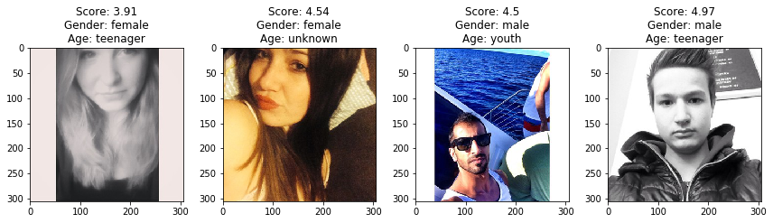
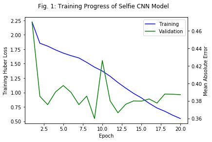
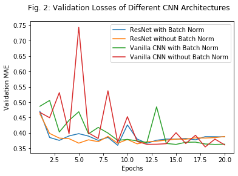
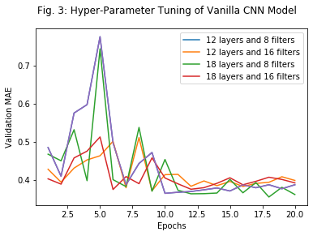
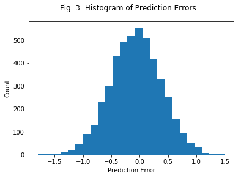
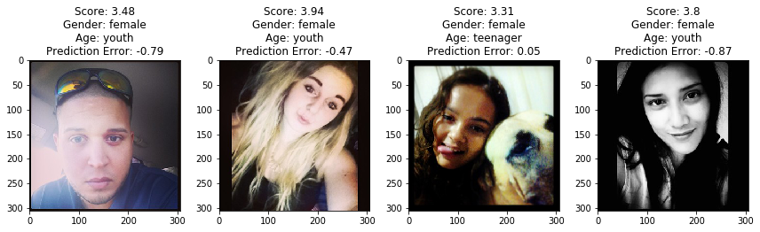

# Red Dragon AI Jumpstart Workshop Course Assignment
# March 2020

## Introduction
The Deep Learning overview course offered by Red Dragon covered basic topics including Feed-Forward Neural Networks, as well as the basics of sequence and Convolutional Neural Network (CNN) architectures. As part of the course requirements, an assignment has to be submitted to demonstrate the attendees' understanding of the content covered during the course.

Inspired by [Karpathy's blog post](http://karpathy.github.io/2015/10/25/selfie/), my objective is to train a CNN model to predict the score indicating how popular a selfie image would be. For this project, the CNN model incorporates residual connections to allow the gradients to "flow" across the deep network. This "flow" arises from the general form of the Residual Network (ResNet), which is given by
\begin{equation}
y = z + f(z),
\end{equation}
with a derivative of
\begin{equation}
\frac{dy}{dz} = 1 + \frac{df}{dz}.
\end{equation}
By the chain rule, we get
\begin{align*}
\frac{dy}{dx} &= \frac{dy}{dz_3} \frac{dz_3}{dz_2} \frac{dz_2}{dz_1} \frac{dz_1}{dx}\\
&= \left(1 + \frac{df}{dz_3}\right) \left(1 + \frac{df}{dz_2}\right) \left(1 + \frac{df}{dz_1}\right) \frac{dz_1}{dx},
\end{align*}
and hence, it can be observed that the gradient of $\displaystyle \frac{dy}{dx}$ has a component which depends directly on the gradient of the first layer $\displaystyle \frac{dz_1}{dx}$, allowing the gradient to "flow" from the input to the output layer. This "flow" has the effect of stabilising the overall training of the deep network. ResNets also have the indirect benefit of preventing the gradient from vanishing. This occurs when $\displaystyle \frac{dz_{k+1}}{dz_k}$ is small for all layers $k \geq 1$. To further stabilise the model, the model also applies Batch Normalisation. In addition, to mitigate the issue of the ReLU gradient saturating to 0 in the negative region (and resulting in no further updates to the weights in the subsequent iterations), Leaky ReLU was used as the activation function instead. 


```python
import numpy as np
import pandas as pd
import matplotlib.pyplot as plt
import matplotlib.image as mpimg

# Define some functions for easy processing. #
def get_age_category(tmp_row):
    if tmp_row["baby"] == 1:
        return "baby"
    elif tmp_row["child"] == 1:
        return "child"
    elif tmp_row["teenager"] == 1:
        return "teenager"
    elif tmp_row["youth"] == 1:
        return "youth"
    elif tmp_row["middle_age"] == 1:
        return "middle_age"
    elif tmp_row["senior"] == 1:
        return "senior"
    else:
        return "unknown"

def get_gender(tmp_row):
    if tmp_row["is_female"] == 0:
        return "male"
    elif tmp_row["is_female"] == 1:
        return "female"
    else:
        return "unknown"
```

### Exploring the Selfie Dataset
The Selfie dataset is a set of 46,836 selfie images extracted from Instagram (to be confirmed) with a total of 36 attributes like age category (child or youth or middle age etc), gender (male or female), lighting conditions (harsh or dim lighting), which was submitted to the Proceedings of the 23rd Annual ACM Conference on Multimedia Conference in 2015. This dataset was made available for research purposes, with each image resized to 306 by 306 pixels.


```python
# Load the Selfie dataset. #
tmp_path = "C:/Users/admin/Desktop/Data/Selfie-dataset/"
tmp_selfie_df = pd.read_csv(tmp_path + "selfie_dataset_annotations.csv")

# Do some simple cleaning. #
tmp_selfie_df["gender"] = [get_gender(
    tmp_selfie_df.iloc[x]) for x in range(len(tmp_selfie_df))]
tmp_selfie_df["age_category"] = [get_age_category(
    tmp_selfie_df.iloc[x]) for x in range(len(tmp_selfie_df))]

# Display the DataFrame. #
tmp_selfie_df[["filename", "score", "gender", "age_category"]].head()
```


<div>
<style scoped>
    .dataframe tbody tr th:only-of-type {
        vertical-align: middle;
    }

    .dataframe tbody tr th {
        vertical-align: top;
    }

    .dataframe thead th {
        text-align: right;
    }
</style>
<table border="1" class="dataframe">
  <thead>
    <tr style="text-align: right;">
      <th></th>
      <th>filename</th>
      <th>score</th>
      <th>gender</th>
      <th>age_category</th>
    </tr>
  </thead>
  <tbody>
    <tr>
      <td>0</td>
      <td>C:/Users/admin/Desktop/Data/Selfie-dataset/ima...</td>
      <td>3.901</td>
      <td>female</td>
      <td>youth</td>
    </tr>
    <tr>
      <td>1</td>
      <td>C:/Users/admin/Desktop/Data/Selfie-dataset/ima...</td>
      <td>4.385</td>
      <td>female</td>
      <td>unknown</td>
    </tr>
    <tr>
      <td>2</td>
      <td>C:/Users/admin/Desktop/Data/Selfie-dataset/ima...</td>
      <td>4.243</td>
      <td>female</td>
      <td>teenager</td>
    </tr>
    <tr>
      <td>3</td>
      <td>C:/Users/admin/Desktop/Data/Selfie-dataset/ima...</td>
      <td>4.169</td>
      <td>male</td>
      <td>teenager</td>
    </tr>
    <tr>
      <td>4</td>
      <td>C:/Users/admin/Desktop/Data/Selfie-dataset/ima...</td>
      <td>3.873</td>
      <td>female</td>
      <td>middle_age</td>
    </tr>
  </tbody>
</table>
</div>


Grouping by its attributes, it can be observed that the data is generally imbalanced, with almost 3 times as many females as males. Youth and teenagers also tend to be more prevalent in this dataset. Despite that, the mean scores of males to females and across the different age categories do not show any observable differences. Due to time constraints, I did not test whether the difference in score is statistically significant nor did any further changes to the CNN model to reduce the effect of this bias. However, I would like to caution readers of the possibility of the model displaying biasness due to the imbalanced nature of the dataset.

One thing that caught my attention was my realisation that the mean scores of children's and babies' selfies were the lowest amongst all the age categories available. I had always thought that pictures showing kids and babies would garner better scores since they are so cute, but on further thought, perhaps this is not surprising since babies most probably can't take selfies (or for that matter, most babies probably don't know how to use a phone).


```python
tmp_group_gender = pd.DataFrame(
    [(x, len(y), np.mean(y["score"])) for \
     x, y in tmp_selfie_df.groupby(["gender"])], 
    columns = ["gender", "count", "mean_score"])

# Display the results. #
tmp_group_gender.sort_values(["count"], ascending=False).head()
```


<div>
<style scoped>
    .dataframe tbody tr th:only-of-type {
        vertical-align: middle;
    }

    .dataframe tbody tr th {
        vertical-align: top;
    }

    .dataframe thead th {
        text-align: right;
    }
</style>
<table border="1" class="dataframe">
  <thead>
    <tr style="text-align: right;">
      <th></th>
      <th>gender</th>
      <th>count</th>
      <th>mean_score</th>
    </tr>
  </thead>
  <tbody>
    <tr>
      <td>0</td>
      <td>female</td>
      <td>33655</td>
      <td>4.415638</td>
    </tr>
    <tr>
      <td>1</td>
      <td>male</td>
      <td>13181</td>
      <td>4.267206</td>
    </tr>
  </tbody>
</table>
</div>


```python
tmp_group_age = pd.DataFrame(
    [(x, len(y), np.mean(y["score"])) for \
     x, y in tmp_selfie_df.groupby(["age_category"])], 
    columns = ["age_category", "count", "mean_score"])

# Display the results. #
tmp_group_age.sort_values(["count"], ascending=False).head(7)
```


<div>
<style scoped>
    .dataframe tbody tr th:only-of-type {
        vertical-align: middle;
    }

    .dataframe tbody tr th {
        vertical-align: top;
    }

    .dataframe thead th {
        text-align: right;
    }
</style>
<table border="1" class="dataframe">
  <thead>
    <tr style="text-align: right;">
      <th></th>
      <th>age_category</th>
      <th>count</th>
      <th>mean_score</th>
    </tr>
  </thead>
  <tbody>
    <tr>
      <td>6</td>
      <td>youth</td>
      <td>31630</td>
      <td>4.394028</td>
    </tr>
    <tr>
      <td>5</td>
      <td>unknown</td>
      <td>6807</td>
      <td>4.316122</td>
    </tr>
    <tr>
      <td>4</td>
      <td>teenager</td>
      <td>6274</td>
      <td>4.365037</td>
    </tr>
    <tr>
      <td>2</td>
      <td>middle_age</td>
      <td>1118</td>
      <td>4.310763</td>
    </tr>
    <tr>
      <td>1</td>
      <td>child</td>
      <td>796</td>
      <td>4.278460</td>
    </tr>
    <tr>
      <td>0</td>
      <td>baby</td>
      <td>196</td>
      <td>4.155434</td>
    </tr>
    <tr>
      <td>3</td>
      <td>senior</td>
      <td>15</td>
      <td>4.371667</td>
    </tr>
  </tbody>
</table>
</div>


Some examples of the selfies in the dataset and their corresponding attributes are shown below. As the images show, and as Karpathy's blog had also mentioned, there are some factors which could possibly affect the scores but are not recorded. For example, the lighting of some images might be too bright, while some might be in grey scale.


```python
# Randomly sample some images to display. #
fig, ax = plt.subplots(ncols=4, figsize=(12, 12))

tmp_idx = np.random.choice(len(tmp_selfie_df), size=4, replace=False)
n_image = 0
for row in ax:
    tmp_row = tmp_selfie_df.iloc[tmp_idx[n_image]]
    tmp_img = mpimg.imread(tmp_row["filename"])
    n_image += 1

    tmp_title = "Score: " + str(round(tmp_row["score"], 2)) + "\n"
    tmp_title += "Gender: " + str(tmp_row["gender"]) + "\n"
    tmp_title += "Age: " + str(tmp_row["age_category"])
    row.imshow(tmp_img)
    row.set(title=tmp_title)
plt.tight_layout()
```





### Convolutional Neural Network (CNN) Model Architecture
The CNN model architecture consists of a total of 16 layers, downsampled every 3 layers. It takes in an image input of 150 by 150 pixels by 3 channels, which we normalise to a value between 0.0 and 1.0 for each channel. Batch Normalization is applied prior to applying a ReLU activation function for each convolutional feature map. The overall CNN architecture is displayed in the cell below, with approximately 1.6 million parameters, and the Huber Loss function was applied.


```python
tmp_model_params = "C:/Users/admin/Desktop/Data/Selfie-dataset/selfie_model_params.txt"
with open(tmp_model_params, "rb") as tmp_file_read:
    for tmp_line in tmp_file_read.readlines():
        print(tmp_line.decode("ascii").replace("\n", ""))
```

    Model: "model"
    _________________________________________________________________
    Layer (type)                 Output Shape              Param #   
    =================================================================
    image_inputs (InputLayer)    [(None, 150, 150, 3)]     0         
    _________________________________________________________________
    block1_cnn_1 (Conv2D)        (None, 75, 75, 16)        1216      
    _________________________________________________________________
    batch_normalization (BatchNo (None, 75, 75, 16)        64        
    _________________________________________________________________
    leaky_re_lu (LeakyReLU)      (None, 75, 75, 16)        0         
    _________________________________________________________________
    block1_cnn2 (Conv2D)         (None, 75, 75, 16)        2320      
    _________________________________________________________________
    batch_normalization_1 (Batch (None, 75, 75, 16)        64        
    _________________________________________________________________
    leaky_re_lu_1 (LeakyReLU)    (None, 75, 75, 16)        0         
    _________________________________________________________________
    block2_cnn_1 (Conv2D)        (None, 75, 75, 16)        2320      
    _________________________________________________________________
    batch_normalization_2 (Batch (None, 75, 75, 16)        64        
    _________________________________________________________________
    leaky_re_lu_2 (LeakyReLU)    (None, 75, 75, 16)        0         
    _________________________________________________________________
    block2_cnn2 (Conv2D)         (None, 75, 75, 16)        2320      
    _________________________________________________________________
    batch_normalization_3 (Batch (None, 75, 75, 16)        64        
    _________________________________________________________________
    leaky_re_lu_3 (LeakyReLU)    (None, 75, 75, 16)        0         
    _________________________________________________________________
    block3_cnn_1 (Conv2D)        (None, 75, 75, 16)        2320      
    _________________________________________________________________
    batch_normalization_4 (Batch (None, 75, 75, 16)        64        
    _________________________________________________________________
    leaky_re_lu_4 (LeakyReLU)    (None, 75, 75, 16)        0         
    _________________________________________________________________
    block3_cnn2 (Conv2D)         (None, 75, 75, 16)        2320      
    _________________________________________________________________
    batch_normalization_5 (Batch (None, 75, 75, 16)        64        
    _________________________________________________________________
    leaky_re_lu_5 (LeakyReLU)    (None, 75, 75, 16)        0         
    _________________________________________________________________
    block4_cnn_1 (Conv2D)        (None, 38, 38, 32)        4640      
    _________________________________________________________________
    batch_normalization_6 (Batch (None, 38, 38, 32)        128       
    _________________________________________________________________
    leaky_re_lu_6 (LeakyReLU)    (None, 38, 38, 32)        0         
    _________________________________________________________________
    block4_cnn2 (Conv2D)         (None, 38, 38, 32)        9248      
    _________________________________________________________________
    batch_normalization_7 (Batch (None, 38, 38, 32)        128       
    _________________________________________________________________
    leaky_re_lu_7 (LeakyReLU)    (None, 38, 38, 32)        0         
    _________________________________________________________________
    block5_cnn_1 (Conv2D)        (None, 38, 38, 32)        9248      
    _________________________________________________________________
    batch_normalization_8 (Batch (None, 38, 38, 32)        128       
    _________________________________________________________________
    leaky_re_lu_8 (LeakyReLU)    (None, 38, 38, 32)        0         
    _________________________________________________________________
    block5_cnn2 (Conv2D)         (None, 38, 38, 32)        9248      
    _________________________________________________________________
    batch_normalization_9 (Batch (None, 38, 38, 32)        128       
    _________________________________________________________________
    leaky_re_lu_9 (LeakyReLU)    (None, 38, 38, 32)        0         
    _________________________________________________________________
    block6_cnn_1 (Conv2D)        (None, 38, 38, 32)        9248      
    _________________________________________________________________
    batch_normalization_10 (Batc (None, 38, 38, 32)        128       
    _________________________________________________________________
    leaky_re_lu_10 (LeakyReLU)   (None, 38, 38, 32)        0         
    _________________________________________________________________
    block6_cnn2 (Conv2D)         (None, 38, 38, 32)        9248      
    _________________________________________________________________
    batch_normalization_11 (Batc (None, 38, 38, 32)        128       
    _________________________________________________________________
    leaky_re_lu_11 (LeakyReLU)   (None, 38, 38, 32)        0         
    _________________________________________________________________
    block7_cnn_1 (Conv2D)        (None, 19, 19, 64)        18496     
    _________________________________________________________________
    batch_normalization_12 (Batc (None, 19, 19, 64)        256       
    _________________________________________________________________
    leaky_re_lu_12 (LeakyReLU)   (None, 19, 19, 64)        0         
    _________________________________________________________________
    block7_cnn2 (Conv2D)         (None, 19, 19, 64)        36928     
    _________________________________________________________________
    batch_normalization_13 (Batc (None, 19, 19, 64)        256       
    _________________________________________________________________
    leaky_re_lu_13 (LeakyReLU)   (None, 19, 19, 64)        0         
    _________________________________________________________________
    block8_cnn_1 (Conv2D)        (None, 19, 19, 64)        36928     
    _________________________________________________________________
    batch_normalization_14 (Batc (None, 19, 19, 64)        256       
    _________________________________________________________________
    leaky_re_lu_14 (LeakyReLU)   (None, 19, 19, 64)        0         
    _________________________________________________________________
    block8_cnn2 (Conv2D)         (None, 19, 19, 64)        36928     
    _________________________________________________________________
    batch_normalization_15 (Batc (None, 19, 19, 64)        256       
    _________________________________________________________________
    leaky_re_lu_15 (LeakyReLU)   (None, 19, 19, 64)        0         
    _________________________________________________________________
    block9_cnn_1 (Conv2D)        (None, 19, 19, 64)        36928     
    _________________________________________________________________
    batch_normalization_16 (Batc (None, 19, 19, 64)        256       
    _________________________________________________________________
    leaky_re_lu_16 (LeakyReLU)   (None, 19, 19, 64)        0         
    _________________________________________________________________
    block9_cnn2 (Conv2D)         (None, 19, 19, 64)        36928     
    _________________________________________________________________
    batch_normalization_17 (Batc (None, 19, 19, 64)        256       
    _________________________________________________________________
    leaky_re_lu_17 (LeakyReLU)   (None, 19, 19, 64)        0         
    _________________________________________________________________
    block10_cnn_1 (Conv2D)       (None, 10, 10, 128)       73856     
    _________________________________________________________________
    batch_normalization_18 (Batc (None, 10, 10, 128)       512       
    _________________________________________________________________
    leaky_re_lu_18 (LeakyReLU)   (None, 10, 10, 128)       0         
    _________________________________________________________________
    block10_cnn2 (Conv2D)        (None, 10, 10, 128)       147584    
    _________________________________________________________________
    batch_normalization_19 (Batc (None, 10, 10, 128)       512       
    _________________________________________________________________
    leaky_re_lu_19 (LeakyReLU)   (None, 10, 10, 128)       0         
    _________________________________________________________________
    block11_cnn_1 (Conv2D)       (None, 10, 10, 128)       147584    
    _________________________________________________________________
    batch_normalization_20 (Batc (None, 10, 10, 128)       512       
    _________________________________________________________________
    leaky_re_lu_20 (LeakyReLU)   (None, 10, 10, 128)       0         
    _________________________________________________________________
    block11_cnn2 (Conv2D)        (None, 10, 10, 128)       147584    
    _________________________________________________________________
    batch_normalization_21 (Batc (None, 10, 10, 128)       512       
    _________________________________________________________________
    leaky_re_lu_21 (LeakyReLU)   (None, 10, 10, 128)       0         
    _________________________________________________________________
    block12_cnn_1 (Conv2D)       (None, 10, 10, 128)       147584    
    _________________________________________________________________
    batch_normalization_22 (Batc (None, 10, 10, 128)       512       
    _________________________________________________________________
    leaky_re_lu_22 (LeakyReLU)   (None, 10, 10, 128)       0         
    _________________________________________________________________
    block12_cnn2 (Conv2D)        (None, 10, 10, 128)       147584    
    _________________________________________________________________
    batch_normalization_23 (Batc (None, 10, 10, 128)       512       
    _________________________________________________________________
    leaky_re_lu_23 (LeakyReLU)   (None, 10, 10, 128)       0         
    _________________________________________________________________
    block13_cnn_1 (Conv2D)       (None, 5, 5, 256)         295168    
    _________________________________________________________________
    batch_normalization_24 (Batc (None, 5, 5, 256)         1024      
    _________________________________________________________________
    leaky_re_lu_24 (LeakyReLU)   (None, 5, 5, 256)         0         
    _________________________________________________________________
    block13_cnn2 (Conv2D)        (None, 5, 5, 256)         590080    
    _________________________________________________________________
    batch_normalization_25 (Batc (None, 5, 5, 256)         1024      
    _________________________________________________________________
    leaky_re_lu_25 (LeakyReLU)   (None, 5, 5, 256)         0         
    _________________________________________________________________
    block14_cnn_1 (Conv2D)       (None, 5, 5, 256)         590080    
    _________________________________________________________________
    batch_normalization_26 (Batc (None, 5, 5, 256)         1024      
    _________________________________________________________________
    leaky_re_lu_26 (LeakyReLU)   (None, 5, 5, 256)         0         
    _________________________________________________________________
    block14_cnn2 (Conv2D)        (None, 5, 5, 256)         590080    
    _________________________________________________________________
    batch_normalization_27 (Batc (None, 5, 5, 256)         1024      
    _________________________________________________________________
    leaky_re_lu_27 (LeakyReLU)   (None, 5, 5, 256)         0         
    _________________________________________________________________
    block15_cnn_1 (Conv2D)       (None, 5, 5, 256)         590080    
    _________________________________________________________________
    batch_normalization_28 (Batc (None, 5, 5, 256)         1024      
    _________________________________________________________________
    leaky_re_lu_28 (LeakyReLU)   (None, 5, 5, 256)         0         
    _________________________________________________________________
    block15_cnn2 (Conv2D)        (None, 5, 5, 256)         590080    
    _________________________________________________________________
    batch_normalization_29 (Batc (None, 5, 5, 256)         1024      
    _________________________________________________________________
    leaky_re_lu_29 (LeakyReLU)   (None, 5, 5, 256)         0         
    _________________________________________________________________
    block16_cnn_1 (Conv2D)       (None, 3, 3, 512)         1180160   
    _________________________________________________________________
    batch_normalization_30 (Batc (None, 3, 3, 512)         2048      
    _________________________________________________________________
    leaky_re_lu_30 (LeakyReLU)   (None, 3, 3, 512)         0         
    _________________________________________________________________
    block16_cnn2 (Conv2D)        (None, 3, 3, 512)         2359808   
    _________________________________________________________________
    batch_normalization_31 (Batc (None, 3, 3, 512)         2048      
    _________________________________________________________________
    leaky_re_lu_31 (LeakyReLU)   (None, 3, 3, 512)         0         
    _________________________________________________________________
    block17_cnn_1 (Conv2D)       (None, 3, 3, 512)         2359808   
    _________________________________________________________________
    batch_normalization_32 (Batc (None, 3, 3, 512)         2048      
    _________________________________________________________________
    leaky_re_lu_32 (LeakyReLU)   (None, 3, 3, 512)         0         
    _________________________________________________________________
    block17_cnn2 (Conv2D)        (None, 3, 3, 512)         2359808   
    _________________________________________________________________
    batch_normalization_33 (Batc (None, 3, 3, 512)         2048      
    _________________________________________________________________
    leaky_re_lu_33 (LeakyReLU)   (None, 3, 3, 512)         0         
    _________________________________________________________________
    block18_cnn_1 (Conv2D)       (None, 3, 3, 512)         2359808   
    _________________________________________________________________
    batch_normalization_34 (Batc (None, 3, 3, 512)         2048      
    _________________________________________________________________
    leaky_re_lu_34 (LeakyReLU)   (None, 3, 3, 512)         0         
    _________________________________________________________________
    block18_cnn2 (Conv2D)        (None, 3, 3, 512)         2359808   
    _________________________________________________________________
    batch_normalization_35 (Batc (None, 3, 3, 512)         2048      
    _________________________________________________________________
    leaky_re_lu_35 (LeakyReLU)   (None, 3, 3, 512)         0         
    _________________________________________________________________
    average_pooling2d (AveragePo (None, 1, 1, 512)         0         
    _________________________________________________________________
    flatten (Flatten)            (None, 512)               0         
    _________________________________________________________________
    linear1 (Dense)              (None, 128)               65664     
    _________________________________________________________________
    linear2 (Dense)              (None, 32)                4128      
    _________________________________________________________________
    outputs (Dense)              (None, 1)                 33        
    =================================================================
    Total params: 17,397,393
    Trainable params: 17,385,297
    Non-trainable params: 12,096
    _________________________________________________________________


### Training the Network
To train the network, I applied a batch size of 32 and a learning rate of $10^{-3}$ and a decay rate of 0.90 after every epoch. The Adam Optimizer with the default beta values and a gradient clipping norm of 2.0 was applied. The train-validation split was 70\% to 20\%, with the remaining images used as the test dataset. After every epoch, the Mean Absolute Error of the validation dataset was computed to identify if early stopping is required. In this project, the model was trained over 20 epochs and no over-fitting was observed over the duration of the training in Fig. 1. The Mean Absolute Error on the test dataset is 0.386. 

As an initial method to study whether CNNs are the most effective methods to train the network, we also train a standard Neural Network and check its performance against the CNN.


```python
train_progress = pd.read_csv(
    "C:/Users/admin/Desktop/TF_Models/selfie_model/selfie_losses.csv")

fig, ax1 = plt.subplots()
ax1.plot(train_progress["epoch"], train_progress["train_huber_loss"], color="b")
ax1.set(xlabel="Epoch", ylabel="Training Huber Loss")

ax2 = ax1.twinx()
ax2.plot(train_progress["epoch"], train_progress["valid_mae"], color="g")
ax2.set(xlabel="Epoch", ylabel="Mean Absolute Error")

fig.suptitle("Fig. 1: Training Progress of Selfie CNN Model")
fig.legend(["Training", "Validation"], bbox_to_anchor=(1, 1), bbox_transform=ax1.transAxes)
```


    <matplotlib.legend.Legend at 0x1c900daa948>





### Ablation Study
In the introductory paragraph, two main techniques was applied to stabilise the training of the neural network. In this section, the effects of adding BN and Residual Connections to the neural network is presented in Table 1 below. As Table 1 shows, Residual Connections did not help the eventual network obtain a lower test error. More surprisingly, the CNN model without using Batch Normalisation and Residual Connections performed the best. Having said that, there is also a possibility that I did not implement the Residual Connection correctly due to the lack of time (the entire code is provided in the Appendix).

<br>
<table cellpadding="0" cellspacing="0" style="border-collapse:collapse">
    <center>Table 1: Regression Errors of Different CNN Architectures</center>
    <tr style="outline: thin solid;">
    </tr>
    <tr>
        <td><center>Residual Connection</center></td>
        <td><center>Batch Normalisation</center></td>
        <td><center>Mean Absolute Error on Test Dataset</center></td>
    </tr>
    <tr>
        <td><center>Yes</center></td>
        <td><center>Yes</center></td>
        <td><center>0.386</center></td>
    </tr>
    <tr>
        <td><center>No</center></td>
        <td><center>Yes</center></td>
        <td><center>0.363</center></td>
    </tr>
    <tr>
        <td><center>Yes</center></td>
        <td><center>No</center></td>
        <td><center>0.378</center></td>
    </tr>
    <tr>
        <td><center>No</center></td>
        <td><center>No</center></td>
        <td><center>0.361</center></td>
    </tr>
    <tr style="outline: thin solid;"></tr>
</table>

Apart from the inclusion of the residual connection(s) and/or the batch normalisation, the networks' parameters remained identical including the number of layers and the number of 2-dimensional convolutional weights and feature maps across each layer.


```python
fig, ax = plt.subplots()
test_loss_path  = "C:/Users/admin/Desktop/TF_Models/selfie_model/"
test_loss_files = ["selfie_losses_no_batch_norm.csv", 
                   "selfie_losses_cnn_batch_norm.csv", 
                   "selfie_losses_cnn_no_batch_norm_12_layers_16_filters.csv"]

ax.plot(train_progress["epoch"], train_progress["valid_mae"])
for test_loss_file in test_loss_files:
    test_loss_df = pd.read_csv(test_loss_path+test_loss_file)
    ax.plot(test_loss_df["epoch"], test_loss_df["valid_mae"])

ax.set(xlabel="Epochs", ylabel="Validation MAE")
ax.legend(["ResNet with Batch Norm", 
           "ResNet without Batch Norm", 
           "Vanilla CNN with Batch Norm", 
           "Vanilla CNN without Batch Norm"])
fig.suptitle("Fig. 2: Validation Losses of Different CNN Architectures")
```


    Text(0.5, 0.98, 'Fig. 2: Validation Losses of Different CNN Architectures')





### Hyper-Parameter Tuning
In this section, the parameters of the CNN model are tuned to identify the "best" model among a pre-defined set of parameters. It is worth noting that the batch size of 32 may not be a suitably large number to compute the batch mean and variances upon, but did not perform any tuning on the batch size parameter. The parameters tuned include the number of filters (8 and 16) and the number of layers (12 and 18). Since the ablation study revealed that the best model is the vanilla CNN model without residual connections or batch normalisation, this model is used to perform hyper-parameter tuning. The results are presented in Table 2 and Fig. 3.

<br>
<table cellpadding="0" cellspacing="0" style="border-collapse:collapse">
    <center>Table 2: Hyper-parameter Tuning of CNN Model Architecture</center>
    <tr style="outline: thin solid;">
    </tr>
    <tr>
        <td><center>Number of Layers</center></td>
        <td><center>Number of Filters</center></td>
        <td><center>Mean Absolute Error on Test Dataset</center></td>
    </tr>
    <tr>
        <td><center>12</center></td>
        <td><center>8</center></td>
        <td><center>0.396</center></td>
    </tr>
    <tr>
        <td><center>18</center></td>
        <td><center>8</center></td>
        <td><center>0.389</center></td>
    </tr>
    <tr>
        <td><center>12</center></td>
        <td><center>16</center></td>
        <td><center>0.361</center></td>
    </tr>
    <tr>
        <td><center>18</center></td>
        <td><center>16</center></td>
        <td><center>0.389</center></td>
    </tr>
    <tr style="outline: thin solid;"></tr>
</table>

It would have been nice to explore a larger range of parameters, but time limitations only allowed me to explore a total of 4 combinations. Nonetheless, it can be observed that models with more parameters do not necessarily though there is a possibility that too much information might have been lost (see Remark 1 below) at the final layer. In this case, the dataset is not huge like ImageNet so deeper models might actually perform worse. 

_Remark 1: For a 18 layer network to be more effective, the architecture may need to be modified, since the final layer of the CNN returned a 1-by-1 matrix. Hence, there is a possibility that too much information might have been lost, causing the 18 layer network to perform much worse than the 12 layer network. It is also possible that more iterations may be required due to the larger number of parameters._ 


```python
num_layers  = [12, 18]
num_filters = [8, 16]
plot_legend = []

fig, ax = plt.subplots()
ax.plot(test_loss_df["epoch"], test_loss_df["valid_mae"])
for num_layer in num_layers:
    for num_filter in num_filters:
        test_loss_file = "selfie_losses_cnn_no_batch_norm_" +\
            str(num_layer) + "_layers_" + str(num_filter) + "_filters.csv"
        test_loss_df = pd.read_csv(test_loss_path+test_loss_file)
        ax.plot(test_loss_df["epoch"], test_loss_df["valid_mae"])
        plot_legend.append(str(num_layer) + " layers and " + str(num_filter) + " filters")

ax.set(xlabel="Epochs", ylabel="Validation MAE")
ax.legend(plot_legend)
fig.suptitle("Fig. 3: Hyper-Parameter Tuning of Vanilla CNN Model")
```


    Text(0.5, 0.98, 'Fig. 3: Hyper-Parameter Tuning of Vanilla CNN Model')





### Analysis of Results
The prediction errors are computed from the test dataset. It is not entirely clear that the model predicts the under-represented age groups' score with a higher error, since the senior age group only had one sample while the MAE of the remaining age categories were within 0.03 of each other. The same finding held for gender, where the MAE between the two genders was kept within 0.01. Hence, the effect of the class imbalance was not obvious for this dataset. From Fig. 3, the histogram of the prediction errors showed that the errors are generally centred about 0 and are symmetric.


```python
test_df = pd.read_csv(
    test_loss_path + "selfie_test_losses_" +\
    "cnn_no_batch_norm_12_layers_16_filters.csv")
test_df = test_df.merge(tmp_selfie_df, on="filename")
test_df["err"] = test_df["score"] - test_df["pred"]

print("Mean Absolute Error in Test Dataset:", 
      str(np.mean(np.abs(test_df["err"].values))))
```

    Mean Absolute Error in Test Dataset: 0.36127195403109646
    


```python
test_df[["filename", "pred", "score", "gender", "age_category"]].head()
```


```python
# Group the errors by age. #
tmp_grp_age_test = pd.DataFrame(
    [(x, len(y), np.mean(np.abs(y["err"]))) for \
     x, y in test_df.groupby(["age_category"])], 
    columns = ["age_category", "count", "mean_abs_error"])

# Display the results. #
tmp_grp_age_test.sort_values(["mean_abs_error"], ascending=True).head(7)
```


<div>
<style scoped>
    .dataframe tbody tr th:only-of-type {
        vertical-align: middle;
    }

    .dataframe tbody tr th {
        vertical-align: top;
    }

    .dataframe thead th {
        text-align: right;
    }
</style>
<table border="1" class="dataframe">
  <thead>
    <tr style="text-align: right;">
      <th></th>
      <th>age_category</th>
      <th>count</th>
      <th>mean_abs_error</th>
    </tr>
  </thead>
  <tbody>
    <tr>
      <td>0</td>
      <td>baby</td>
      <td>21</td>
      <td>0.343318</td>
    </tr>
    <tr>
      <td>2</td>
      <td>middle_age</td>
      <td>119</td>
      <td>0.358320</td>
    </tr>
    <tr>
      <td>6</td>
      <td>youth</td>
      <td>3180</td>
      <td>0.359644</td>
    </tr>
    <tr>
      <td>4</td>
      <td>teenager</td>
      <td>627</td>
      <td>0.361454</td>
    </tr>
    <tr>
      <td>5</td>
      <td>unknown</td>
      <td>662</td>
      <td>0.367100</td>
    </tr>
    <tr>
      <td>1</td>
      <td>child</td>
      <td>74</td>
      <td>0.382139</td>
    </tr>
    <tr>
      <td>3</td>
      <td>senior</td>
      <td>1</td>
      <td>0.750212</td>
    </tr>
  </tbody>
</table>
</div>


```python
# Group the errors by gender. #
tmp_grp_gender_test = pd.DataFrame(
    [(x, len(y), np.mean(np.abs(y["err"]))) \
     for x, y in test_df.groupby(["gender"])], 
    columns = ["gender", "count", "mean_abs_error"])

# Display the results. #
tmp_grp_gender_test.sort_values(["mean_abs_error"], ascending=True).head()
```


<div>
<style scoped>
    .dataframe tbody tr th:only-of-type {
        vertical-align: middle;
    }

    .dataframe tbody tr th {
        vertical-align: top;
    }

    .dataframe thead th {
        text-align: right;
    }
</style>
<table border="1" class="dataframe">
  <thead>
    <tr style="text-align: right;">
      <th></th>
      <th>gender</th>
      <th>count</th>
      <th>mean_abs_error</th>
    </tr>
  </thead>
  <tbody>
    <tr>
      <td>0</td>
      <td>female</td>
      <td>3374</td>
      <td>0.360812</td>
    </tr>
    <tr>
      <td>1</td>
      <td>male</td>
      <td>1310</td>
      <td>0.362457</td>
    </tr>
  </tbody>
</table>
</div>


```python
fig, ax = plt.subplots()
ax.hist(test_df["err"], bins=25)
ax.set(xlabel="Prediction Error", ylabel="Count")
fig.suptitle("Fig. 3: Histogram of Prediction Errors")
```


    Text(0.5, 0.98, 'Fig. 3: Histogram of Prediction Errors')





A random sample (not cherry picked) of 4 test images and their corresponding errors are displayed below. As the left most image's attributes show, there may be erroneous labelling of some of the attributes. In this case, the left most image appeared to me to be more of a male than a female but it is tagged as a female. This might affect the analysis of the results. 


```python
# Randomly select a few images and their predicted scores to display. #
fig, ax = plt.subplots(ncols=4, figsize=(12, 12))

tmp_idx = np.random.choice(len(test_df), size=4, replace=False)
n_image = 0
for row in ax:
    tmp_row = test_df.iloc[tmp_idx[n_image]]
    tmp_img = mpimg.imread(tmp_row["filename"])
    n_image += 1

    tmp_title = "Score: " + str(round(tmp_row["score"], 2)) + "\n"
    tmp_title += "Gender: " + str(tmp_row["gender"]) + "\n"
    tmp_title += "Age: " + str(tmp_row["age_category"]) + "\n"
    tmp_title += "Prediction Error: " + str(round(tmp_row["err"], 2))
    row.imshow(tmp_img)
    row.set(title=tmp_title)
plt.tight_layout()
```





### Concluding Remarks
In this project, I trained a CNN model to predict the popularity score of a selfie taken. Although the data was imbalanced with more young people and females, the prediction errors between the under-represented classes was not observably different from that of the dominant classes. The different model architectures were analysed using ablation study, whereby the effects of Batch Normalisation and Residual Connections was presented. Perhaps surprisingly, the simpler model which applied neither Batch Normalisation nor Residual Connections had the best performance on the test dataset. 

I also tested different model configurations using hyper-parameter tuning of the number of layers as well as the number of filters. (To include discussion on hyper-parameter tuning)

### Code Appendix
As this model was trained locally and not on Colab, the entire code is presented in this section.


```python
import os
import time
import shutil
import numpy as np
import pandas as pd
import tensorflow as tf
from tensorflow.keras import layers

# Inspired by Karpathy's blog post: #
# http://karpathy.github.io/2015/10/25/selfie/ #

# Function to parse the image. #
def decode_img(img, img_width, img_height):
    # convert the compressed string to a 3D uint8 tensor
    img = tf.image.decode_jpeg(img, channels=3)
    # Use `convert_image_dtype` to convert to floats in the [0,1] range.
    img = tf.image.convert_image_dtype(img, tf.float32)
    # resize the image to the desired size.
    return tf.image.resize(img, [img_width, img_height])

def process_path(file_path, label, img_width, img_height):
    # load the raw data from the file as a string
    img = tf.io.read_file(file_path)
    img = decode_img(img, img_width, img_height)
    return img, label

def process_test_path(file_path, img_width, img_height):
  # load the raw data from the file as a string
  img = tf.io.read_file(file_path)
  img = decode_img(img, img_width, img_height)
  return img

# Build the model. #
def build_model(
    img_width, img_height, n_layers=12, 
    n_filters=8, p_drop=0.75, batch_norm=True):
    x_inputs = tf.keras.Input(
        shape=(img_height, img_width, 3), name='image_inputs')
    
    curr_inputs = x_inputs
    for n_block in range(n_layers):
        block_name = "block" + str(n_block+1) + "_"
        if n_block % 3 == 0:
            cnn_strides = (2, 2)
            if n_block > 0:
                n_filters = n_filters*2
        else:
            cnn_strides = (1, 1)
        
        # CNN Layer. #
        if n_block == 0:
            x_1 = layers.Conv2D(
                n_filters, (5, 5), strides=cnn_strides, 
                padding='same', name=block_name+"cnn_1")(curr_inputs)
        else:
            x_1 = layers.Conv2D(
                n_filters, (3, 3), strides=cnn_strides, 
                padding='same', name=block_name+"cnn_1")(curr_inputs)
        
        if batch_norm:
            x1b = layers.BatchNormalization()(x_1)
            x1o = layers.LeakyReLU()(x1b)
        else:
            x1o = layers.LeakyReLU()(x_1)
        
        x_2 = layers.Conv2D(
            n_filters, (3, 3), 
            padding='same', name=block_name+"cnn2")(x1o)
        x2b = layers.BatchNormalization()(x_2)
        x2o = layers.LeakyReLU()(x2b)
        
        if batch_norm:
            x2b = layers.BatchNormalization()(x_2)
            x2o = layers.LeakyReLU()(x2b)
        else:
            x2o = layers.LeakyReLU()(x_2)
        
        # Residual Layer. #
        if cnn_strides != (1, 1) and \
            curr_inputs.shape[-1] != n_filters:
            x_add = layers.Conv2D(
                n_filters, (3, 3), strides=cnn_strides, 
                padding="same", name=block_name+"residual")(curr_inputs)
        elif curr_inputs.shape[-1] != n_filters:
            x_add = layers.Conv2D(
                n_filters, (1, 1), 
                padding="same", name=block_name+"residual")(curr_inputs)
        elif cnn_strides != (1, 1):
            x_add = layers.Conv2D(
                n_filters, (3, 3), strides=cnn_strides, 
                padding="same", name=block_name+"residual")(curr_inputs)
        else:
            x_add = curr_inputs
        x_norm = layers.BatchNormalization()(x_add)
        x_relu = layers.LeakyReLU()(x_norm)
        
        x_residual  = x2o + x_relu
        curr_inputs = x_residual
    
    # Average Pooling. #
    x_avg_pool = layers.AveragePooling2D((2, 2))(x_residual)

    # Linear Layer. #
    x_flatten = layers.Flatten()(x_avg_pool)
    x_linear1 = layers.Dense(
        128, activation="relu", name="linear1")(x_flatten)
    x_linear2 = layers.Dense(
        32, activation="relu", name="linear2")(x_linear1)
    x_outputs = layers.Dense(
        1, activation="linear", name="outputs")(x_linear2)
    
    # Define the Keras model. #
    selfie_model = tf.keras.Model(inputs=x_inputs, outputs=x_outputs)
    return selfie_model

def model_loss(true_score, pred_score):
    loss_fn = tf.keras.losses.Huber(delta=0.05)
    return 100.0*loss_fn(true_score, pred_score)

# Compile into a Tensorflow function. #
@tf.function
def train_step(
    model, images, true_scores, 
    optimizer, learning_rate=1.0e-3):
    optimizer.lr.assign(learning_rate)
    
    with tf.GradientTape() as grad_tape:
        pred_scores = model(images, training=True)
        tmp_losses  = model_loss(true_scores, pred_scores)
        
        tmp_gradients = \
            grad_tape.gradient(tmp_losses, model.trainable_variables)
        optimizer.apply_gradients(
            zip(tmp_gradients, model.trainable_variables))
    return tmp_losses

def train(
    model, train_dataset, valid_dataset, 
    batch_size, epochs, width, height, optimizer, 
    init_lr=1.0e-3, decay=0.75, display_step=100):
    n_updates  = 0
    epoch_step = int(len(train_dataset) / batch_size)
    tmp_train_list = []
    
    tot_losses = 0.0
    for epoch in range(epochs):
        print("Epoch", str(epoch) + ":")
        start_time = time.time()
        learn_rate = decay**epoch * init_lr
        
        # Cool the GPU. #
        if (epoch+1) % 5 == 0:
            print("Cooling GPU.")
            time.sleep(120)
        
        for n_updates in range(epoch_step):
            batch_idx = \
                np.random.permutation(len(train_dataset))[:batch_size]
            batch_df  = train_dataset.iloc[batch_idx]
            
            image_batch = np.concatenate(
                tuple([np.expand_dims(np.array(
                    process_test_path(str(x), width, height)), axis=0) \
                        for x in list(batch_df["filename"].values)]), axis=0)
            image_label = tf.cast(batch_df["score"].values, tf.float32)
            
            tmp_losses = train_step(
                model, image_batch, image_label, 
                optimizer, learning_rate=learn_rate)
            tot_losses += tmp_losses.numpy()
            
            if (n_updates+1) % display_step == 0:
                tmp_string = "Intermediate Loss at Epoch " + str(epoch)
                tmp_string += " step " + str(n_updates+1) + ":"
                print(tmp_string, str(tot_losses/(n_updates+1)))
        
        tmp_true_scores = []
        tmp_pred_scores = []
        for image_batch, image_label in valid_dataset:
            tmp_scores = model.predict(image_batch).flatten()
            tmp_pred_scores.append(tmp_scores)
            tmp_true_scores.append(image_label.numpy())
        
        tmp_pred_scores = np.concatenate(tuple(tmp_pred_scores))
        tmp_true_scores = np.concatenate(tuple(tmp_true_scores))
        mae_error = np.mean(np.abs(tmp_true_scores - tmp_pred_scores))
        
        avg_losses = tot_losses / epoch_step
        tot_losses = 0.0
        elapsed_time = (time.time() - start_time) / 60.0
        tmp_train_list.append((epoch+1, avg_losses, mae_error))
        
        epoch += 1
        print("Learning Rate:", str(optimizer.lr.numpy()))
        print("Elapsed time:", str(elapsed_time), "mins.")
        print("Average Epoch Loss:", str(avg_losses) + ".")
        print("Validation Mean Abs. Error:", str(mae_error) + ".")
        print("-" * 75)
    
    tmp_train_df = pd.DataFrame(
        tmp_train_list, columns=["epoch", "train_huber_loss", "valid_mae"])
    return tmp_train_df

# Load the Selfie dataset. #
tmp_path = "C:/Users/admin/Desktop/Data/Selfie-dataset/"
tmp_selfie_df = pd.read_csv(tmp_path + "selfie_dataset_annotations.csv")

# The Selfie classifier task. #
label_dict = sorted(tmp_selfie_df.columns[2:])

# Split into Train and Validation data sets. #
percent_train = 0.7
percent_valid = 0.2

np.random.seed(1234)
idx_perm = np.random.permutation(len(tmp_selfie_df))

n_train  = int(percent_train * len(tmp_selfie_df))
n_valid  = n_train + int(percent_valid * len(tmp_selfie_df))
train_df = tmp_selfie_df.iloc[idx_perm[:n_train]]
valid_df = tmp_selfie_df.iloc[idx_perm[n_train:n_valid]]
test_df  = tmp_selfie_df.iloc[idx_perm[n_valid:]]

# Define the Neural Network. #
learning_rate = 1.0e-3
gradient_clip = 2.0

batch_norm   = False
img_height   = 150
img_width    = 150
n_layers     = 12
decay_rate   = 0.90
restore_flag = False

n_epochs   = 20
batch_size = 32
n_classes  = len(label_dict)

# Define the checkpoint callback function. #
train_loss = \
    "C:/Users/admin/Desktop/TF_Models/selfie_model/selfie_losses"
ckpt_path  = \
    "C:/Users/admin/Desktop/TF_Models/selfie_model/selfie_model"
ckpt_model = \
    "C:/Users/admin/Desktop/TF_Models/selfie_model/selfie_keras_model"

if batch_norm:
    test_loss  = \
        "C:/Users/admin/Desktop/TF_Models/selfie_model/selfie_test_losses.csv"
    train_loss += ".csv"
    ckpt_path  += ".ckpt"
else:
    test_loss  = "C:/Users/admin/Desktop/TF_Models/" +\
        "selfie_model/selfie_test_losses_no_batch_norm.csv"
    train_loss += "_no_batch_norm.csv"
    ckpt_path  += "_no_batch_norm.ckpt"
    ckpt_model += "_no_batch_norm"
ckpt_dir = os.path.dirname(ckpt_path)

# Set the number of threads to use. #
tf.config.threading.set_intra_op_parallelism_threads(1)
tf.config.threading.set_inter_op_parallelism_threads(1)

if not restore_flag:
    try:
        os.mkdir(ckpt_model)
    except:
        shutil.rmtree(ckpt_model)
        os.mkdir(ckpt_model)

# Load the weights if continuing from a previous checkpoint. #
selfie_model = build_model(img_width, img_height, n_filters=16)
optimizer = tf.keras.optimizers.Adam(
    learning_rate=learning_rate, clipnorm=2.0)

if restore_flag:
    checkpoint = tf.train.Checkpoint(
        optimizer=optimizer, model=selfie_model)
    ck_manager = tf.train.CheckpointManager(
        checkpoint, directory=ckpt_model, max_to_keep=1)
    
    status = checkpoint.restore(ck_manager.latest_checkpoint)

# Save the model as an image file. #
#tf.keras.utils.plot_model(
#    selfie_model, to_file=tmp_path+"selfie_cnn_model.png")

# Print out the model summary. #
print(selfie_model.summary())
with open(tmp_path+"selfie_model_params.txt", "w") as tmp_file_open:
    selfie_model.summary(print_fn=lambda x: tmp_file_open.write(x + "\n"))
print("-" * 75)

# Generate the Data pipeline. #
# Shuffle was done within the train function as the Tensorflow #
# shuffle function took too long to shuffle the dataset.       #
one_valid_vec = np.ones(len(valid_df), dtype=np.int32)
valid_dataset = tf.data.Dataset.from_tensor_slices((
    tf.cast(valid_df["filename"].values, tf.string),
    tf.cast(valid_df["score"].values, tf.float32), 
    img_width*one_valid_vec, img_height*one_valid_vec))
valid_dataset = valid_dataset.map(process_path)
valid_dataset = valid_dataset.batch(batch_size, drop_remainder=False)

print('Fit model on training data.')
tmp_train_df = train(
    selfie_model, train_df, valid_dataset, 
    batch_size, n_epochs, img_height, img_width, 
    optimizer, init_lr=learning_rate, decay=decay_rate)

# Evaluate on some random samples of the validation dataset. #
one_test_vec = np.ones(len(test_df), dtype=np.int32)
test_dataset = tf.data.Dataset.from_tensor_slices((
    tf.cast(test_df["filename"].values, tf.string), 
    img_width*one_test_vec, img_height*one_test_vec))
test_dataset = test_dataset.map(process_test_path)
test_dataset = test_dataset.batch(batch_size, drop_remainder=False)

# Generate a DataFrame of predictions. #
test_true_scores = test_df["score"].values
test_pred_scores = []
for image_batch in test_dataset:
    tmp_scores = selfie_model.predict(image_batch).flatten()
    test_pred_scores.append(tmp_scores)
test_pred_scores = np.concatenate(tuple(test_pred_scores))

tmp_columns_df  = ["filename", "pred", "actual"]
test_results_df = pd.DataFrame([(
    test_df.iloc[x]["filename"], 
    test_pred_scores[x], test_true_scores[x]) \
        for x in range(len(test_df))], columns=tmp_columns_df)

test_mae = np.mean(np.abs(test_true_scores - test_pred_scores))
print("-"*50)
print("Test Set MAE:", str(test_mae))
print(test_results_df.head(25))
tmp_train_df.to_csv(train_loss, index=False)
test_results_df.to_csv(test_loss, index=False)
```
